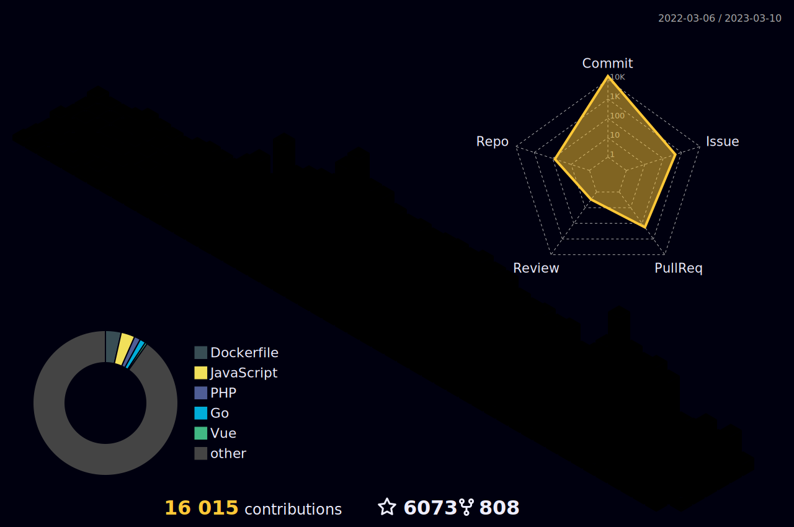

  

  
<h2 align="center">Hi there 👋, I'm sliderSun! </h2>

### 🤗 欢迎来访

### 🦚 

  

点击展开 ...

点击展开 ...

- ####   [ChatLLMs](https://www.zhihu.com/column/c_1626633393965309953)
  
  - 🐻 [ChatGLM-6B P-Tuning v2 教程](https://zhuanlan.zhihu.com/p/619417296)

- ####   [NLP面试集锦](https://www.zhihu.com/column/c_1149290938089279488)
  
  - 🐻 [Transformer、Like-Bert、对比学习、ChatGPT相关面试集锦](https://zhuanlan.zhihu.com/p/149634836)
  - 🎃 [关于Transformer的那些个为什么](https://zhuanlan.zhihu.com/p/360144789)
  - 🚀 [关于BERT中的那些为什么](https://zhuanlan.zhihu.com/p/360343071)
  - 🌋 [关于CNN、RNN、LSTM、Transformer、BERT参数计算的那些疑问](https://zhuanlan.zhihu.com/p/360125522)
  - 🌁 [灵魂拷问之word2vec](https://zhuanlan.zhihu.com/p/165355551)
  - 😺 [BERT源码阅读笔记](https://zhuanlan.zhihu.com/p/403057261)
  
- ####   [优选读](https://www.zhihu.com/column/zl-yxd)
  
  - 🐻 [那些轻轻拍了拍Attention的后浪们](https://zhuanlan.zhihu.com/p/161733629)
  - 🎃 [InfoCSE：信息聚合对比学习的句子表示](https://zhuanlan.zhihu.com/p/575219521)
  - 🚀 [DiffCSE：结合对比学习和ELECTRA的句子表示](https://zhuanlan.zhihu.com/p/503491410)
  - 🌋 [ESimCSE：无监督句子嵌入对比学习的增强样本构建方法](https://zhuanlan.zhihu.com/p/409124038)
  - 🌁 [MixCSE ：混合负样本无监督句子表示的对比学习](https://zhuanlan.zhihu.com/p/555939177)
  - 😺 [MoCoSE : 对比学习中负样本的影响](https://zhuanlan.zhihu.com/p/555770079)
  - 🐻 [DisCo：句子表示的对比知识蒸馏](https://zhuanlan.zhihu.com/p/555748085)
  - 🎃 [ArcCSE | 基于角度margin的对比学习](https://zhuanlan.zhihu.com/p/555369904)
  - 🚀 [VIRT:通过虚拟交互改进基于表示的文本匹配模型](https://zhuanlan.zhihu.com/p/443757608)
  - 🌋 [NLP对比表示中的对抗学习](https://zhuanlan.zhihu.com/p/440860495)
  - 🌁 [PAUSE：基于PU损失和多项式退火的未标记的句子嵌入训练方法](https://zhuanlan.zhihu.com/p/409570497)
  - 😺 [Keyword-Attentive Deep Semantic Matching](https://zhuanlan.zhihu.com/p/135991533)
  - 🐻 [The Illustrated Stable Diffusion](https://zhuanlan.zhihu.com/p/596087332)

- ####   [中文自然语言处理](https://www.zhihu.com/column/c_1133844347605966848)
  
  - 🐻 [“全双工连续对话”轻轻拍了拍“唤醒词”](https://zhuanlan.zhihu.com/p/161563225)
  - 🚀 [修剪BERT以加速推理](https://zhuanlan.zhihu.com/p/161729106)
  - 🌋 [压缩BERT以加快预测速度](https://zhuanlan.zhihu.com/p/161728001)

### 🏆 Github Profile Trophy

点击展开 ...

### 🧰 语言工具

<         
 

### 🧰 机器学习
<code></code>
<code></code>
<code></code>
<code></code>
<code></code>
<code></code>
<code></code>
<code></code>

